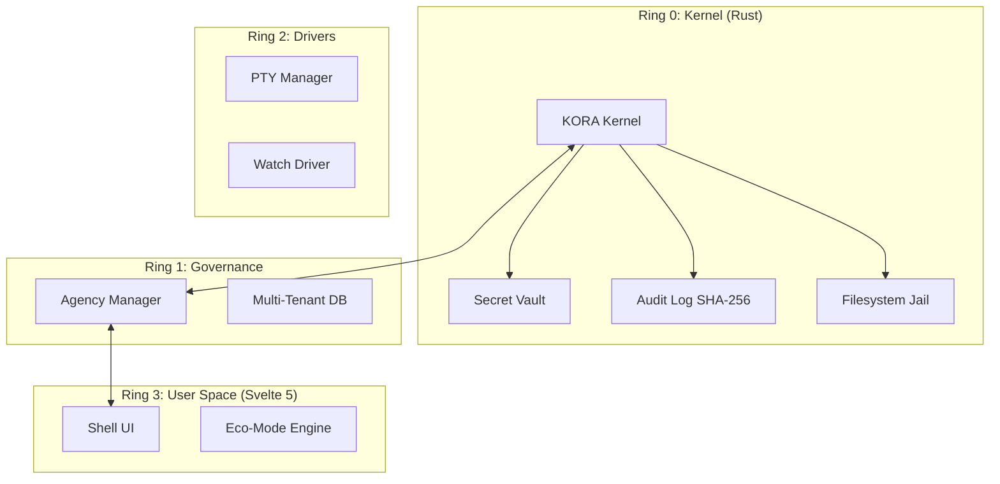

# 🌌 KORA OS: Cyber-Industrial Operating System

[](https://opensource.org/licenses/Apache-2.0)
[]()
[]()

KORA OS is a high-performance, hybrid-stack operating system designed for industrial-grade AI orchestration and secure data governance. Built on a foundation of Rust and Svelte 5, it implements a zero-trust architecture across four security rings.

## 🏗️ System Architecture



## 🛠️ Tech Stack

- **Core Engine**: Rust (Tauri 2.0 / Tokio)
- **Frontend**: Svelte 5 (Runes) / Tailwind CSS v4
- **Persistence**: SQLite (sqlx) with WAL mode
- **AI Orchestration**: OpenClaw Engine (open-source LLM runtime)
- **Security**: SHA-256 Chaining, Memory-Mapped Zero-Copy RAG, Path Jailing

## 🚀 Quick Start (Lite Mode)

1. **Clone the repository**:
   ```bash
   git clone https://github.com/ClaudioCeppi83/kora-os-kernel.git
   cd kora-os-kernel
   ```

2. **Install dependencies**:
   ```bash
   pnpm install
   ```

3. **Launch in Debug Mode**:
   ```bash
   pnpm tauri dev
   ```

## ⚡ Performance Targets
- **Cold Start**: < 2s (Ready to interaction)
- **Memory Footprint**: < 150MB (Idle / Suspended AI)
- **RAG Efficiency**: Zero-Copy via `memmap2`

---

## 🛡️ Security Protocol
Vulnerabilities should be reported via encrypted channels as specified in [SECURITY.md](SECURITY.md).

## 📄 License
KORA OS is licensed under the **Apache License 2.0**. See the [LICENSE](LICENSE) file for details.
